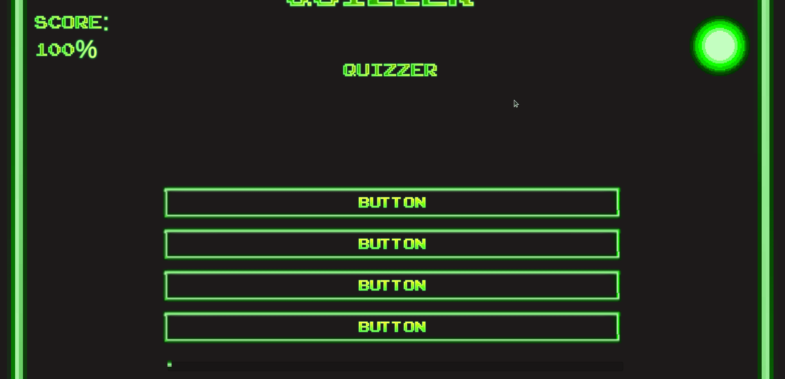

# Unity Course Projects - Several games

I did these to get accustomed Unity Editor and C# scripting by watching Udemy gamedev.tv tutorial series on 2D and 3D game development. This repository is updated almost daily.

## fetch_quest
 

- Triggers
- Colliders
- Unity basic methods
- How Unity works
- Time and deltaTime

## elastic_mania
 

Snowboarding game with pixel graphics.

- Edge colliders
- Cinemachine Virtual camera
- Framing transposer
- Profiles
- Empty gameobjects
- Effector
- Torque
- Particle effects
- Win and lose conditions
- Sound effects and sound listeners

## quizzer
 

A regular quiz app with not so regular backstory.

- Using previsualization canvas
- Canvas editing
- TextMeshPro
- Prefabs
- Scriptable Objects
- Splitting variables to blocks under specific header
- Program states
- List manipulation in C# (Count, Contains, Add, Remove, RemoveAt, ListClear)

## jetpacker
 

First project on Unity3D, fly a rocket from one start platform to finish platform.
Use space key to throttle and arrow keys to guide the ship.

- Onion design
- Directional light
- Using Vector3 classes for up, forward and right.
- Framerate independent movement
- Framing tools
- Spotlights
- Using two seperate audio sources.
- Adding a relative force to an object.
- Applying rotation to a rigid body.
- Setting constraints to a rigid body.

## Notes
- I had accustomed to explicitly tell that functions accept no parameters by adding void inside the braces while studying C. `int foo(void)` In C# this is not even possible.
- Scripts have to be assigned to an object to create a Gameobject of that class.
- On VSCode, press F2 when your variable is highlighted to rename all instances of that variable.
- Use QWERTY to switch between transform, rotation, scaling and translation modes in Unity3D
- You cannot change scene name before saving. Otherwise all the changes are lost.
- Using transform.translate to move object goes past the rigidbody property. If you want to collision work properly, you
have to use rigidbody.Velocity

## Biggest blocks
- Use Screen x and screen y to control the virtual camera position.
- UI components are handled differently in rendering order than other components.

## Links
In which order loops are executed [Link](https://docs.unity3d.com/Manual/ExecutionOrder.html)
